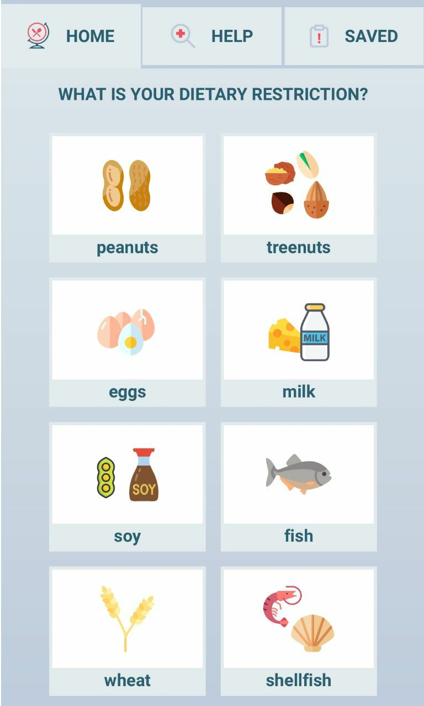
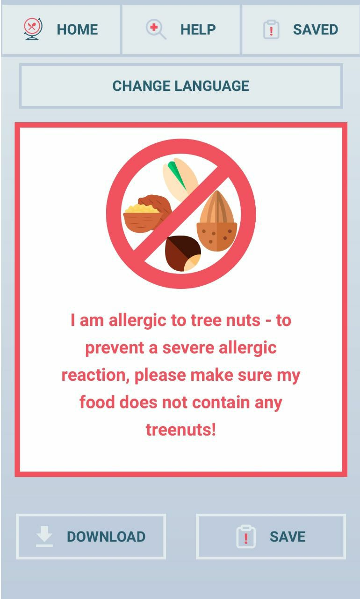
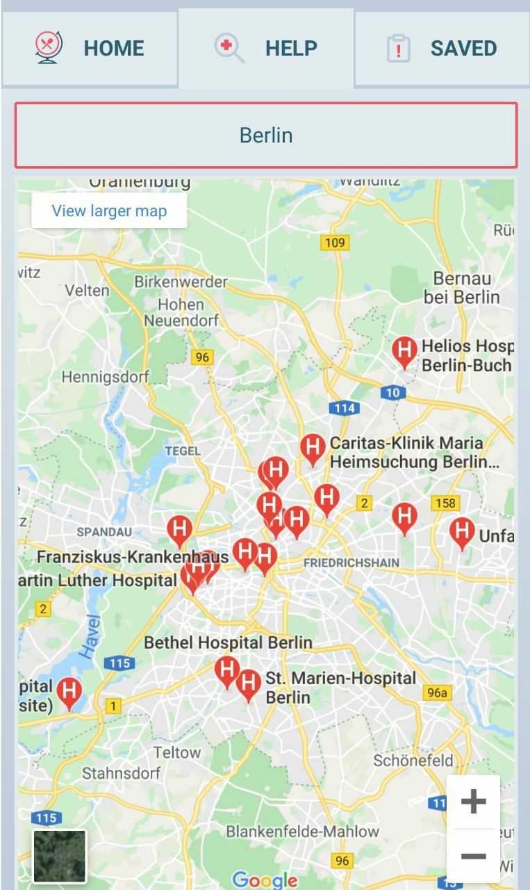

This project was bootstrapped with [Create React App](https://github.com/facebook/create-react-app).

# Trallergy - eat safe travel much

This application allows you to travel safely despite dietary restrictions. Generate warning-cards based on your allergy and a selected language! You can download them or save them to your favoutites for easy access and/or offline use. In case of an emergency Trallergy shows you all hospitals closeby! So eat safe and travel much!





# Hosting

Trallergy is hosted on Heroku.

[Trallergy](https://trallergy.herokuapp.com/)

## Usage

To run Tralergy, clone the repository and install the client and server dependencies:

```
npm install
cd client
npm install
```

Start Trallergy:

```
cd server
npm run server
```

and

```
cd client
npm start
```

### Make Trallergy Grow!

You speak a language that is not represented in Trallergy yet? Send your translation and become a hero for travelers with allergies! :)

**Please translate the following sentence:
"I am allergic to [...] - to prevent a severe allergic reaction, please make sure my food does not contain any [...]!"
For these allergies: milk, soy, peanuts, treenuts, soy, eggs, wheat, fish, shellfish**
